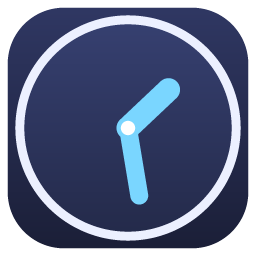

# Ora Clock

A Fliqlo-style desktop clock for Windows, built with Electron. It comes with six clock
faces, liquid-glass themes, Spotify and YouTube playback, and a set of focus tools.



## Features

- **6 clock faces:** Flip (default), Digital, Analog, Rings, Word, Binary
- **15 themes plus Custom:** pick your own colors, clock font and font weight
- **Liquid glass:** blur, refraction and a cursor-following highlight. On Windows 11 it uses the Acrylic background.
- **Music:** Spotify (OAuth PKCE, no client secret) and YouTube (audio only, or the video as the background)
- **Tools:** Pomodoro, countdown timer, stopwatch, weekday alarms, world clock
- **Window:** always on top, click-through overlay, tray, launch at startup, night dim, OLED burn-in shift, global shortcuts
- **Languages:** English and Vietnamese

## Getting started

```bash
npm install
npm start
```

Build the Windows installer (NSIS and portable) into `dist/`:

```bash
npm run dist
```

## Shortcuts

| Key | Action |
| --- | --- |
| `Space` | Play / pause music |
| `F` / `F11` | Fullscreen |
| `S` | Settings panel |
| `T` / `C` | Next theme / next clock face |
| `Ctrl` + `T` | Toggle always on top |
| `Esc` | Close settings / exit fullscreen |

## Spotify setup

1. Create an app at <https://developer.spotify.com/dashboard>.
2. Add the redirect URI `http://127.0.0.1:8888/callback` and enable **Web API**.
3. In Ora Clock, open **Settings → Music → Spotify**, paste the **Client ID** and click **Connect**.

Playback control requires Spotify Premium. Credentials stay in
`%APPDATA%\Ora Clock\settings.json` and are never sent anywhere except Spotify.

## Development

| Command | Purpose |
| --- | --- |
| `npm run dev` | Run with renderer logs piped to the terminal |
| `npm run selftest` | Cycle every tab, face, theme and font, then check layout at 6 window sizes |
| `npm run icon` | Regenerate `assets/icon.png` |

```
src/main/      Electron main process: window, tray, IPC, loopback server, Spotify, settings
src/renderer/  UI: clock faces, themes, settings panel, players, tools
```

The UI is served from `http://127.0.0.1:<port>` instead of `file://` because the
YouTube IFrame API does not work from a `file://` origin.

## License

MIT
